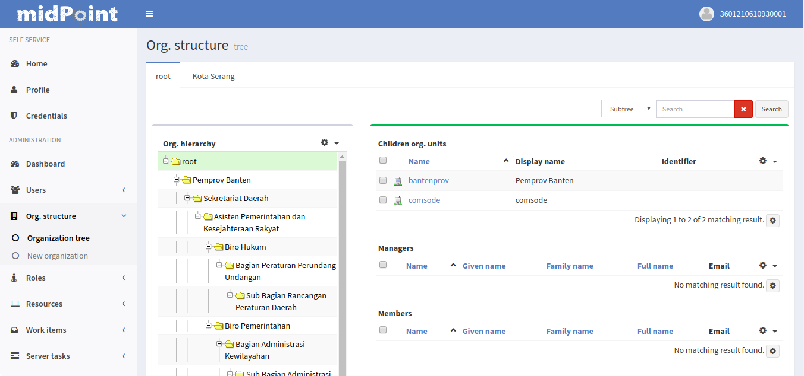
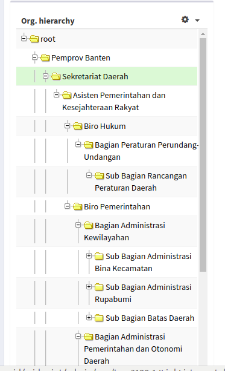
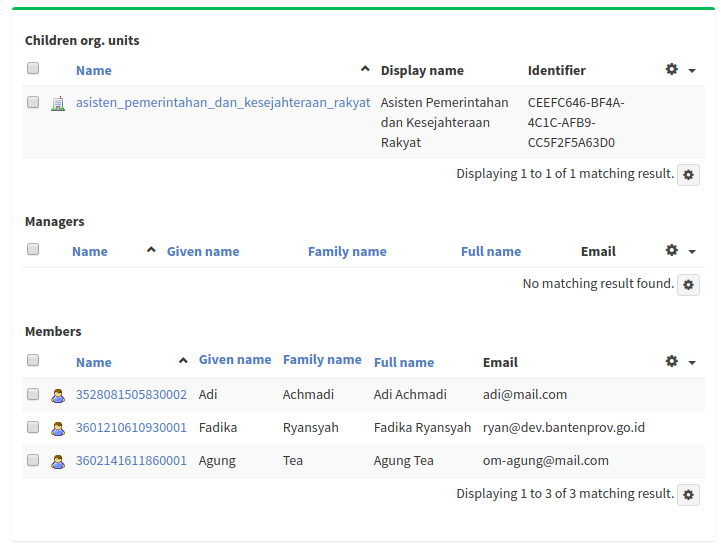
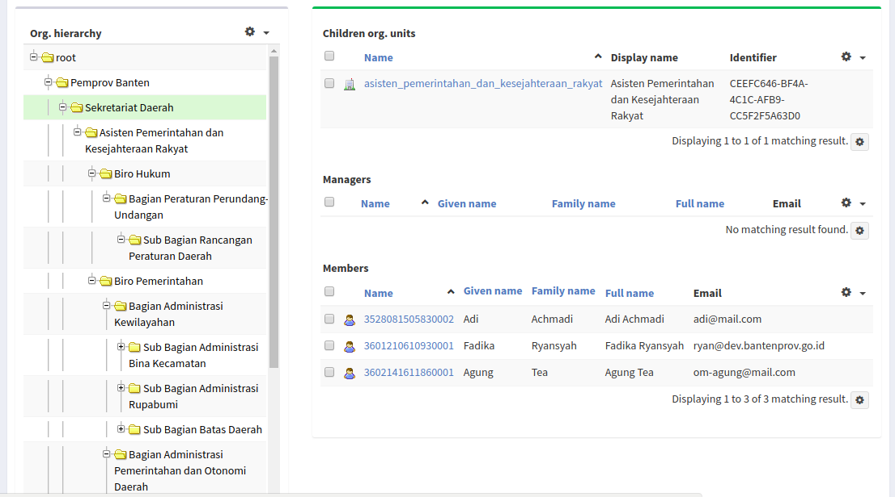
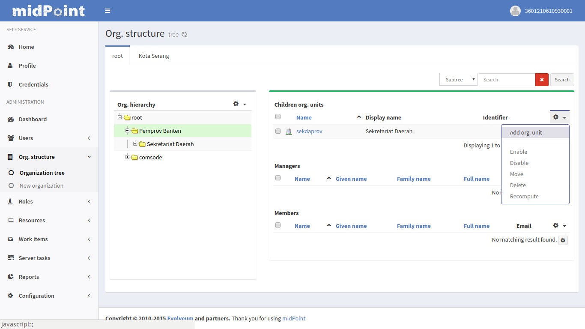
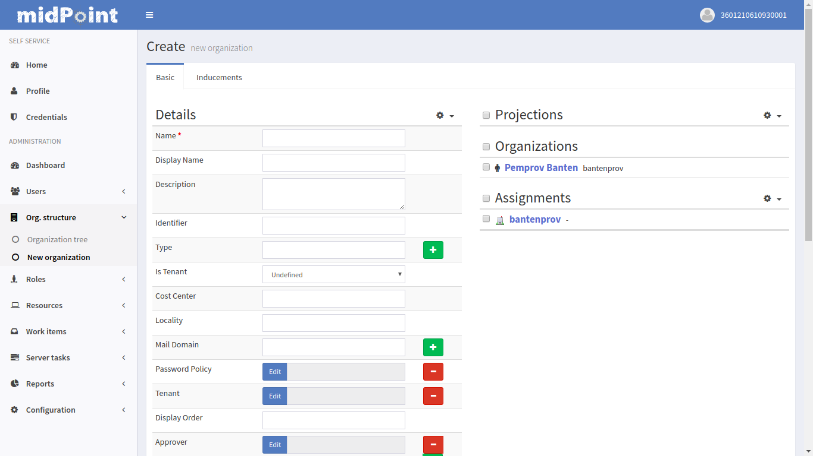
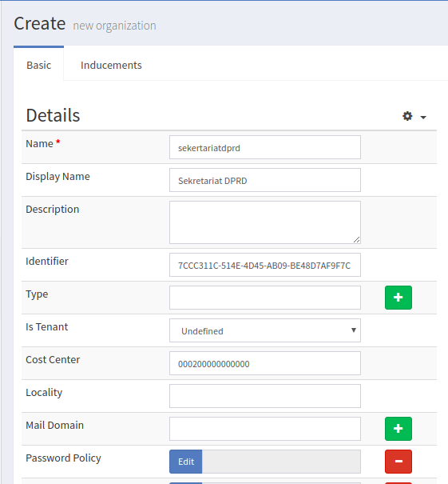
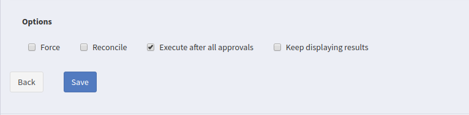
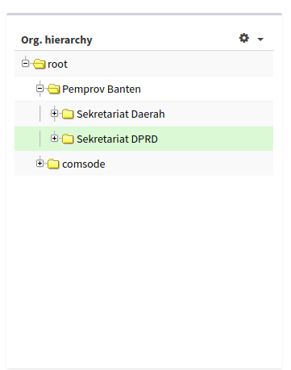
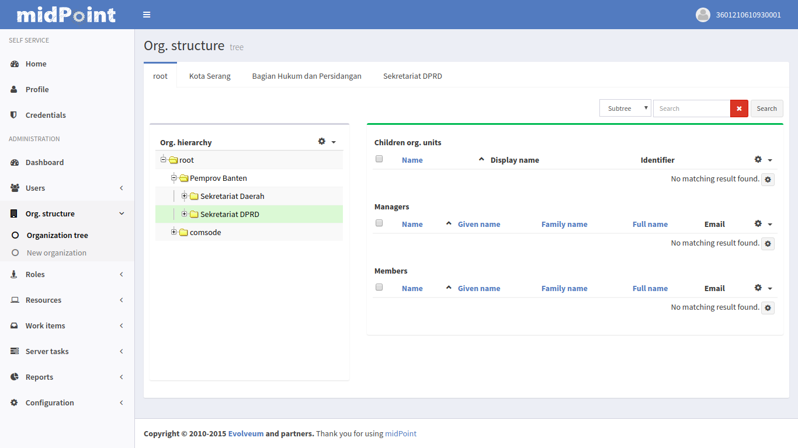

---
title: Manajemen Organisasi
type: panduan
order: 105
---

## Menu dan Cara Penggunaan Manajemen Organisasi

### Tampilan Halaman Organization Structure

 

Halaman ini berfungsi untuk menampilkan struktur organisasi pemerintahan yang ada di Provinsi Banten. Pada halaman ini administrator dapat menambahkan, melihat, merubah, dan menghapus data struktur organisasi yang terdapat di Pemerintahan. 

 

Gambar di atas merupakan struktur hirarki organisasi pemerintahan yang ada di Provinsi Banten sesuai dengan level-nya. Setiap unit kerja memiliki level yang berbeda sesuai kewenangannya, dan juga setiap unit kerja membawahi unit kerja yang levelnya berada di bawahnya. Setiap unit kerja memiliki kode dan identifier (UUID) yang berbeda-beda.

 

Gambar di atas merupakan tampilan dari data struktur hirarki, di menu ini terdapat data dari hirarki yang dipilih baik itu nama unit kerja, identifier, identitas kepala unit kerja dan juga bawahannya. Untuk melihat data struktur hirarki kita harus mengklik folder hirarki dari unit kerja yang ingin dilihat. Berikut ini merupakan gambar detail unit kerja yang dipilih:

 

Untuk menambahkan unit kerja baru pada struktur hirarki maka kita harus memilih terlebih dahulu struktur hirarki yang ingin ditambahkan unit kerjanya, data unit kerja bisa dilihat di halaman [ini](https://opd-01.dev.bantenprov.go.id/laravel-opd). Misalnya kita ingin menambah unit kerja baru yang memiliki level 1 yaitu **Sekretariat DPRD**, maka kita harus mengklik folder **Pemprov Banten** pada struktur hirarki karena unit kerja level 1 harus berada di dalam folder **Pemrov Banten**, lalu kita klik icon setting di menu data hirarki seperti pada gambar dan pilih **Add org. unit** . 

 
 
Maka akan muncul halaman untuk menambah unit kerja baru seperti gambar di bawah ini:

 
 
Pada halaman ini kita hanya akan mengisi 4 field saja yaitu: 
 1. Name: Field ini diisi dengan nama unit kerja dan semuanya huruf kecil, misalkan **sekretariatdprd**.
 2. Display Name: Field ini diisi dengan nama resmi dari unit kerja yang ingin di tambahkan, misalkan **Sekretariat DPRD**.
 3. Identifier: Field ini diisi dengan UUID dari unit kerja yang ingin di tambahkan, misalkan **7CCC311C-514E-4D45-AB09-BE48D7AF9F7C**.
 4. Cost Center: Field ini diisi dengan kode dari unit kerja yang ingin di tambahkan, misalkan **000200000000000**.

Berikut ini merupakan gambar form yang sudah terisi:

 

Jika Sudah tersisi maka langkah selanjutnya menekan tombol save yang terdapat di bagian bawah halaman seperti gambar di bawah ini:

Setelah menekan tombol save maka unit kerja baru akan muncul di struktur hirarki, pada contoh ini yaitu unit kerja **Sekretariat DPRD**. Jika dilihat pada folder hirarki, unit kerja **Sekretariat DPRD** terletak di bawah unit kerja **Pemrov Banten** yang mana menunjukan bahwa unit kerja level 1 berhasil di tambahkan. 

Jika kita klik folder **Sekretariat DPRD** maka akan muncul tampilan data dari unit kerja **Sekretariat DPRD** di sebelah kanan, seperti unit kerja yang dibawahinya dan juga orang yang bertanggung jawab terhadap unit kerja tersebut. Saat ini di dalam data tersebut masih kosong dan kita akan menambahkan unit kerja yang ada di bawah **Sekretariat DPRD** yaitu yang memiliki level 2 sampai level 5.

Selanjutnya kita akan menambahkan unit kerja baru yang memiliki level 2 pada unit kerja **Sekertariat DPRD** yaitu unit kerja **Bagian Hukum dan Persidangan**. Unit kerja ini (**Bagian Hukum dan Persidangan**) akan di tambahkan pada folder **Sekertariat DPRD** karena memiliki level 2 dan terletak di bawah **Sekertariat DPRD** jika dilihat pada halaman  [ini](https://opd-01.dev.bantenprov.go.id/laravel-opd). 

